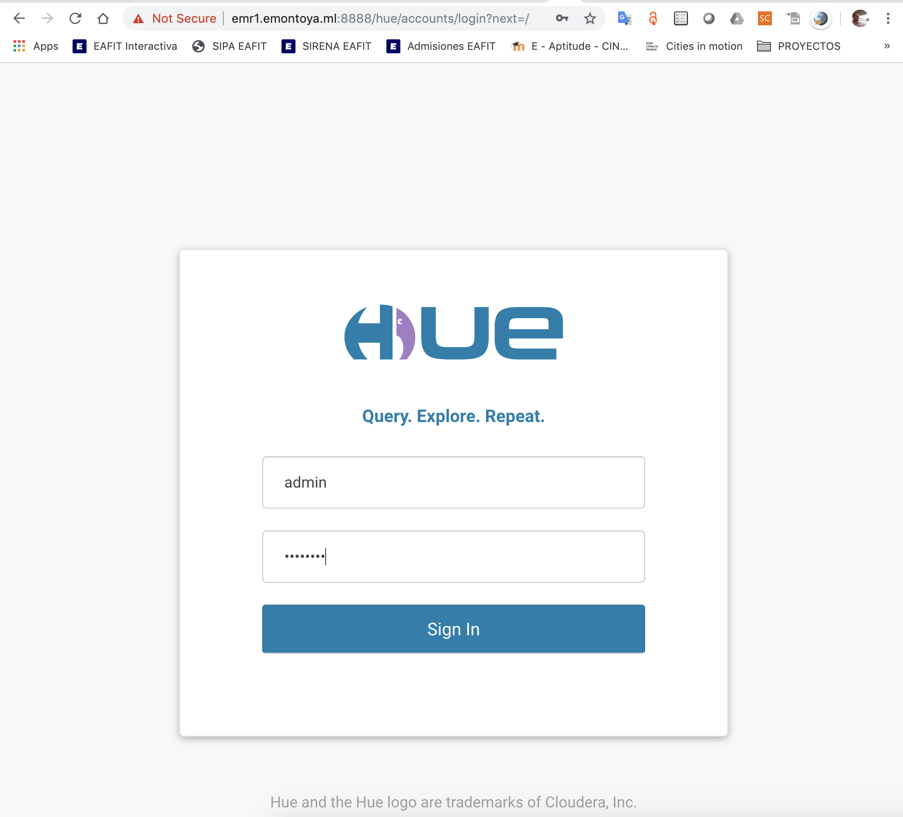
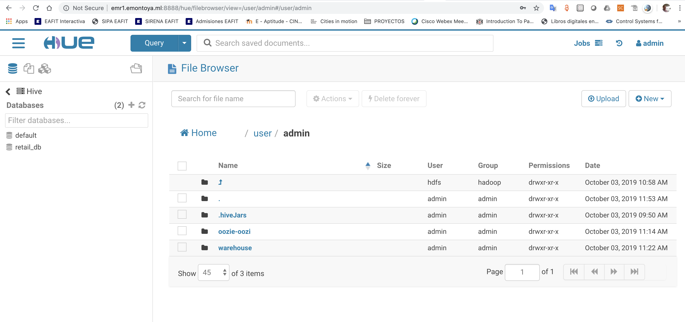
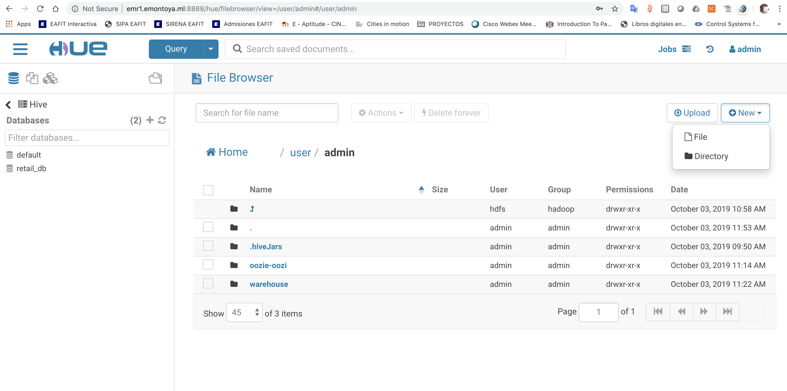
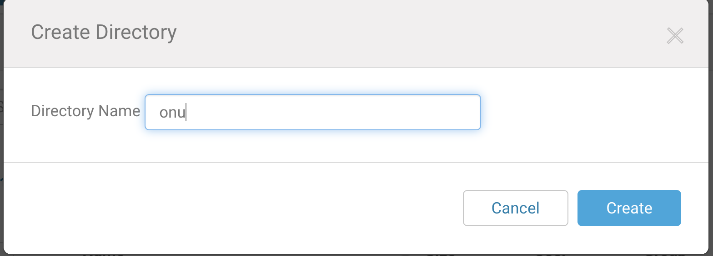
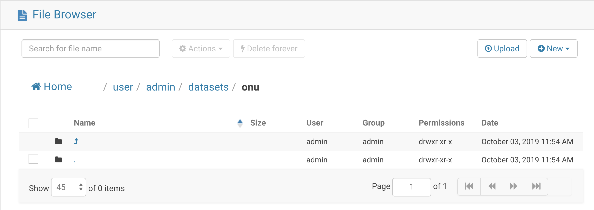

# Universidad EAFIT

# Curso ST0263 Tópicos Especiales en Telemática, 2024-1

# Laboratorio HDFS

## 1. CONECTARSE AL CLUSTER AMAZON EMR:

## Por Terminal: (cada quien tiene su propio servidor ec2 del master EMR)

```bash
ssh -i ~/vockey.pem hadoop@ec2.compute-1.amazonaws.com
```

## 2. GESTIÓN DE ARCHIVOS EN HDFS VÍA TERMINAL

1. Cargar los datos de los datasets de trabajo del tutorial en HDFS
2. Cada participante creara en hdfs un directorio 'datasets' en su 'home' (/user/hadoop)
3. En 'datasets' los archivos ya deben estar descomprimidos para ser procesables.
4. Datasets: [datasets](../datasets)

### Listar archivos HDFS

Para efectos de esta guia, es equivalente el comando "hadoop fs" y "hdfs dfs". La diferencia es que "hdfs dfs" es solo para sistemas de archivos HDFS, pero "hadoop fs" soporta otros adicionales como Amazon S3.

Instalar git en el servidor EMR:

```bash
sudo yum install git
```

Verifique que haya clonado el repo de la materia previamente:

```bash
git clone https://github.com/st0263eafit/st0263-241.git
```

### Listar archivos HDFS

```bash
hdfs dfs -ls /
hdfs dfs -ls /user
hdfs dfs -ls /user/hadoop
hdfs dfs -ls /user/hadoop/datasets
```

### Crear tu propio directorio de 'datasets' en HDFS

```bash
hdfs dfs -mkdir /user/hadoop/datasets
```

### Copiar archivos locales (al servidor gateway) hacia HDFS

Se asume que tiene los datos LOCALES se encuentran en /datasets en el gateway

También están en este github, y por terminal debería copiarlos por SSH/SCP al servidor Gateway por la VPN.

También están en Amazon S3: s3://st0263datasets/datasets

```bash
hdfs dfs -mkdir /user/hadoop/datasets
hdfs dfs -mkdir /user/hadoop/datasets/gutenberg-small
```

- Archivos locales FS en el emr-master:

  ```bash
  hdfs dfs -put $HOME/st0263-241/bigdata/datasets/gutenberg-small/*.txt /user/hadoop/datasets/gutenberg-small/
  ```

- Archivos en Amazon s3:

  ```bash
  hadoop distcp s3://st0263datasets/datasets/airlines.csv /tmp/
  ```

- Copia recursiva de datos

  ```bash
  hdfs dfs -copyFromLocal $HOME/st0263-241/bigdata/datasets/* /user/hadoop/datasets/
  ```

Listar archivos:

```bash
hdfs dfs -ls /user/hadoop/datasets
hdfs dfs -ls /user/hadoop/datasets/gutenberg-small/
```

### Copiar archivos de HDFS hacia el servidor local (gateway)

```bash
hdfs dfs -get /user/hadoop/datasets/gutenberg-small/* ~/mis_datasets/
```

(El directorio 'mis_datasets' debe estar creado)

Otro comando para traer:

```bash
hdfs dfs -copyToLocal /user/hadoop/datasets/gutenberg/gutenberg-small.zip ~/mis_datasets/
ls -l mis_datasets
```

### Probar otros commandos

Se aplica los siguientes comandos a:

    hdfs dfs -<command>

comandos:

    du <path>             uso de disco en bytes
    mv <src> <dest>       mover archive(s)
    cp <src> <dest>       copiar archivo(s)
    rm <path>             borrar archive(s)
    put <localSrc> <dest-hdfs> copiar local a hdfs
    cat <file-name>       mostrar contenido de archivo
    chmod [-R] mode       cambiar los permisos de un archivo
    chown <username> files   cambiar el dueño de un archivo
    chgrp <group> files      cambiar el grupo de un archivo

# 3. GESTIÓN DE ARCHIVOS VÍA HUE en AMAZON EMR

## Login




## Explorar archivos



## Crear un directorio






## Subir (upload) archivos




## Ver contenido de un archivo


